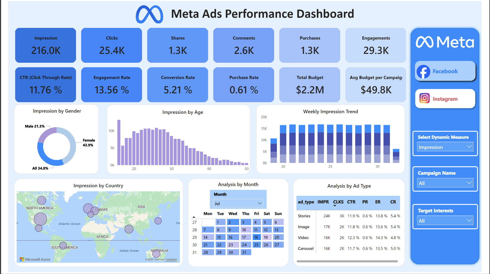
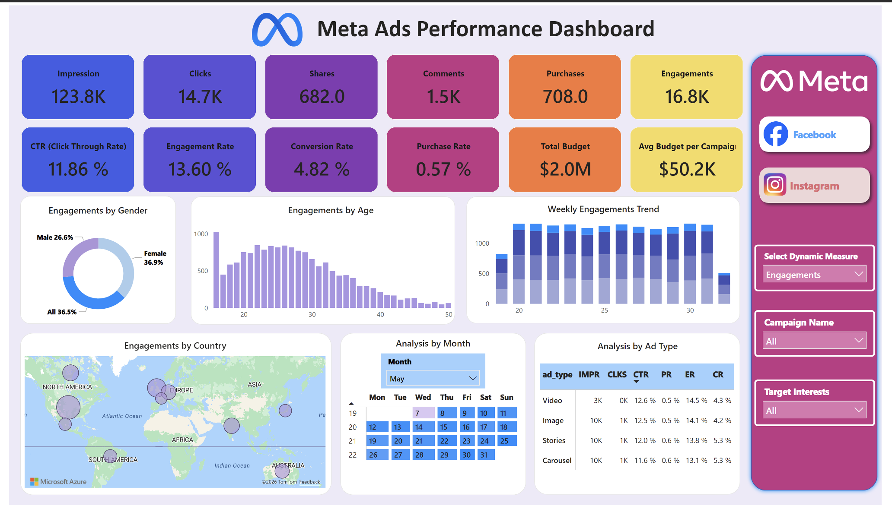

# 📊 Meta Ads Performance Dashboard

An interactive **Power BI dashboard project** built to analyze **Meta advertising campaign performance across Facebook and Instagram**.  
This dashboard helps track campaign effectiveness, audience engagement, conversion trends, demographic insights, and budget efficiency.

---

## 📌 Project Overview
The goal of this dashboard is to provide a **single view of ad campaign performance** by combining KPI monitoring, demographic segmentation, geo analysis, and campaign-level trend tracking.

The dashboard enables users to:
- Monitor top campaign KPIs
- Compare Facebook vs Instagram performance
- Analyze audience demographics by age and gender
- Track geo-level ad reach
- Evaluate campaign budget utilization
- Identify best-performing ad formats

---

## 📈 Key KPIs
- **Impressions**
- **Clicks**
- **Shares**
- **Comments**
- **Purchases**
- **Engagements**
- **CTR (Click Through Rate)**
- **Engagement Rate**
- **Conversion Rate**
- **Purchase Rate**
- **Total Budget**
- **Average Budget per Campaign**

---

## 📊 Dashboard Features
- KPI cards for campaign performance summary
- Facebook and Instagram page-level drilldowns
- Dynamic KPI selector
- Campaign name slicer
- Interest-based filtering
- Demographic analysis by age and gender
- Weekly impression trend analysis
- Geo map for country-level reach
- Ad-type performance comparison table
- Monthly trend slicer and calendar view

---

## 🛠️ Tools & Technologies
- **Power BI**
- **DAX**
- **Excel**
- **Data Modeling**
- **Interactive Slicers**
- **KPI Design**
- **Geo Visualization**

---

## 💡 Business Insights
- Facebook campaigns generated strong overall reach with high impression volume
- Instagram campaigns showed better engagement performance for select audience segments
- Audience age group **22–30** delivered the highest impressions
- Story and carousel ads showed stronger CTR compared to image ads
- North America contributed the highest campaign reach

---

## 📂 Dataset
This project uses a **sample Meta Ads dataset in Excel format** created for portfolio and dashboard demonstration purposes.

---

## 📸 Dashboard Preview

### Facebook Dashboard

### Instagram Dashboard

